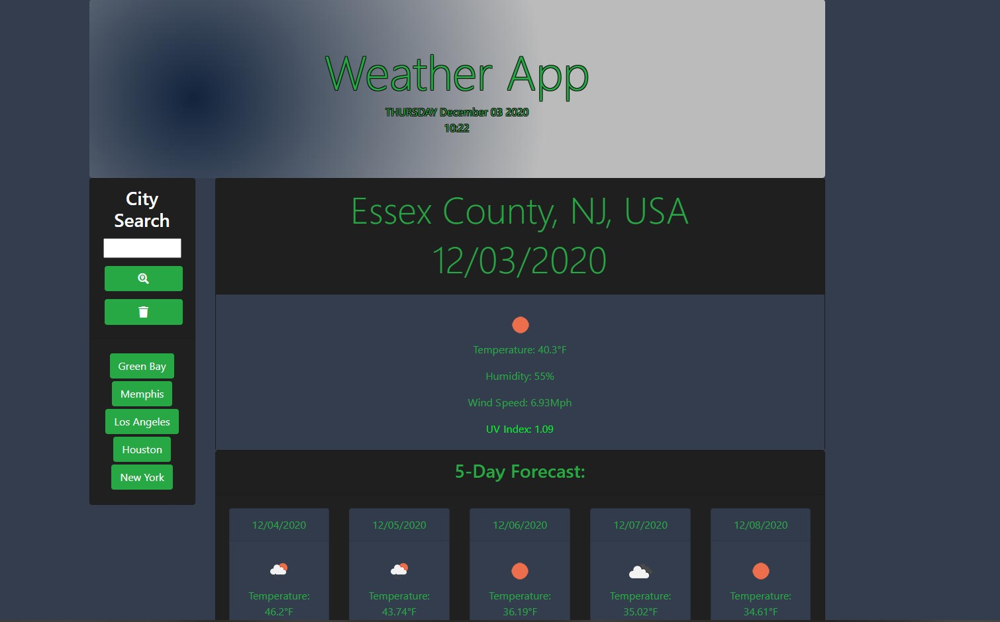

# README

## Table of Contents

[Description](#Description)

[Installation](#Installation)

[Usage](#Usage)

[ScreenShots](#Screenshots)

[License](#License)

[Contributors](#Contributors)

[Contact](#Contact)

[Tests](#Tests)

## Description

AS A traveler
I WANT to see the weather outlook for multiple cities
SO THAT I can plan a trip accordingly

- GIVEN a weather dashboard with form inputs
- WHEN I search for a city
- THEN I am presented with current and future conditions for that city and that city is added to the search history
- WHEN I view current weather conditions for that city
- THEN I am presented with the city name, the date, an icon representation of weather conditions, the temperature, the humidity, the wind speed, and the UV index
- WHEN I view the UV index
- THEN I am presented with a color that indicates whether the conditions are favorable, moderate, or severe
- WHEN I view future weather conditions for that city
- THEN I am presented with a 5-day forecast that displays the date, an icon representation of weather conditions, the temperature, and the humidity
- WHEN I click on a city in the search history
- THEN I am again presented with current and future conditions for that city
- WHEN I open the weather dashboard
- THEN I am presented with the last searched city forecast

## Installation

N/A 

## Usage

Visit https://madhatter2084.github.io/weatherapp/ 

## Screeshots

## License

- n/a

## Contributors

- Matt Rikard

## Contact

- To report bugs or general inquiries, you may contact me at matthew.rikard@gmail.com

## Tests

- n/a
